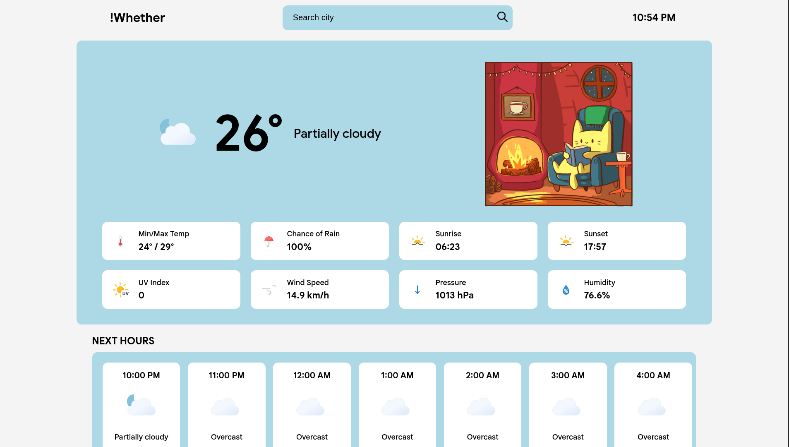

# Weather App

A simple web application that lets users search for current and future weather information by city. The app uses the free tiers of the Visual Crossing Weather API and the GIPHY API to fetch weather data and related visuals.

This small project helped me understand concepts such as APIs, promises, and asynchronous JavaScript using async/await.

## Features

- Search weather by city name
- View current weather conditions
- Access future weather forecasts
- Clean and intuitive user interface
